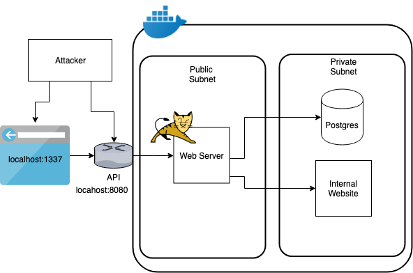

# Vulnado - Intentionally Vulnerable Java Application

This application and exercises will take you through some of the OWASP top 10 Vulnerabilities and how to prevent them.

## Up and running

1. Install Docker for [MacOS](https://hub.docker.com/editions/community/docker-ce-desktop-mac) or [Windows](https://hub.docker.com/editions/community/docker-ce-desktop-windows). You'll need to create a Docker account if you don't already have one.
2. `git clone git://github.com/ScaleSec/vulnado`
3. `cd vulnado`
4. `docker-compose up`
5. Open a browser and navigate to the client to make sure it's working: [http://localhost:1337](http://localhost:1337)
6. Then back in your terminal verify you have connection to your API server: `nc -vz localhost 8080`

## Architecture

The docker network created by `docker-compose` maps pretty well to a multi-tier architecture where a web server is publicly available and there are other network resources like a database and internal site that are not publicly available.

## Exercises

* [SQL Injection](exercises/01-sql-injection.md)
* [XSS - Cross Site Scripting](exercises/02-xss.md)
* [SSRF - Server Side Request Forgery](exercises/03-ssrf.md)
* [RCE - Remote Code Execution & Reverse Shell](exercises/04-rce-reverse-shell.md)

## Continuous Integration

This repository uses GitHub Actions for Continuous Integration (CI). The CI workflow is defined in the `.github/workflows/ci.yml` file.

The CI workflow is triggered on push and pull request events to the `main` branch. It consists of the following jobs:

* `build`: Sets up Java 8, checks out the repository, and runs `mvn clean install` to build the application.
* `test`: Runs after the `build` job, sets up Docker, and runs `docker-compose up` to start the services and verify the application.

You can view the CI results in the "Actions" tab of the GitHub repository.

Note: The CI workflow now includes a step to check for the existence of Docker Compose before running the Docker container. This ensures that Docker Compose is available on the runner, preventing potential failures.
